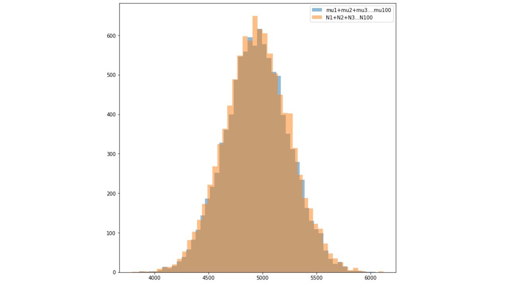

# Homework-1 (Due on Thursday, March 1st, 2018)

      Note, some sites in chromosome 21 are not bi-allelic SNPs. Please only use biallelic
      SNPs. These are sites where the entry in the REF column is a single letter in this set
      [A,T,C,G] AND the entry in the ALT column is also a single letter in this set [A,T,C,G]
      
      1. Compute the number of segregating sites per population for chromosome 21.
        Plot the results. Does the trend follow the trends from Figure 1b from the 1000 Genomes paper?
      
      2. Show with simulations, that if you have 100 Poisson independent random
      variables with means mu1, mu2,…,mu100 (you pick values for the mus), then
      the sum N1 + N2 + N3 + … + N100 is Poisson with parameter (mu1 + mu2 +…
      + mu100).
      
      3. Identify the singletons in the global sample (in the row, only one individual
      is 0|1 or 1|0 and everyone else is 0|0). From that set, find the number of
      singletons per genome per population. Do a scatter plot similarly

## Question-1: Compute the number of segregating sites 

  ### STEP-1: 
  I removed first 252 rows, which started with “#, using this bash command:
  sed -e '1,252d' ALL.chr21.phase3_shapeit2_mvncall_integrated_v5a.20130502.genotypes.vcf >  sample_file.txt
  ### STEP-2
    The input file was ready after the 1st step. 
    First of all, a dictionary was made to store all the individual IDs as key and population name as their value
    Second dictionary was created as an empty dictionary, which will be storing all the Individual IDs as Key and the total number of segregating sites as its value
  ### STEP-3, the VCF file was read line by line,
    The first line of VCF consisted of Individual IDs, which was sored in the second Dictionary as key.
    Then for each line some conditions were checked:
    If the position not is bi-allelic 
    If the genotype is 0|1 or 1|0
    If both above conditions were true, a counter was added to the second Dictionary in front of the individual ID
    After finishing the loop, the total number of Segregating sites were printed along with its population in a file.
    After plotting the segregation sites, I found the plot followed same trend as figure 1-b in 1000 genome paper.

## The code which I wrote: 

  ###### first hash
    
        personCountryHash = {}
        with open("dict.txt") as dict:
            for line in dict:
                (key, val) = line.split()
                personCountryHash[str(key)] = val  
                #print(key, val)
        dict.close()

  ###### second hash
        countryCountHash = {}

        personArray = [] * 2513
        arry = []

        with open("sample_file.txt", "r") as f:
            with open ("output.txt", "w") as g:
                lineCount = 0
                for line in f:
              if (lineCount == 0):
                        lineCount = lineCount + 1
                        continue

                    if(lineCount == 1):
                        lineCount = lineCount + 1
                        personArray = line.split('\t')
                        continue

                    lineCount = lineCount + 1
                    arry = line.split("\t")
                    #personArry = line.split("\t")
                    # 
                    l = len(arry)
                    c = 0
                    onlyValidLength = False
                    if ((len(arry[3]) == 1) and (len(arry[4]) == 1)):
                            if((arry[3] == 'A' or 'G' or 'T' or 'G') and (arry[4] == 'A' or 'T' or 'G' or 'C')):
                                c = 0
                                for i in range(l):
                                    if(i<9):
                                        continue
                                    x = arry[i]
                                    if (x == ("0|1") or x == ("1|0")):
                                        person = personArray[i]
                                        country = personCountryHash[person]
                                        if (country in countryCountHash):
                                            countryCountHash[country] = countryCountHash[country] + 1
                                        else:
                                            countryCountHash[country] = 1

                for j in countryCountHash:
                    combo = j +"\t" + str(countryCountHash[j]) + "\n"
                    g.write(combo)
            g.close()
        f.close()

## Question-2 (Simulation)

    First of all 100 random numbers were generated which were treated as means
    Poisson distribution was generated for each of the 100 means. 
    From each Poisson distribution one value was fetched, which will be treated as Poisson independent random variables (N1, N2, N3 etc)
    Sum of the Means was computed
    Sum of Poisson independent random variables were computed
    These above steps was iterated 10,000 times over a loop
    Two Histogram plots were made each showing distribution of means and Poisson independent random variables. 
    Both of the histograms were then overlapped to see the differences
    

    

  ### This is the code I wrote:
  
          import random
          import numpy as np
          import pylab
          import scipy.stats as stats
          from matplotlib import pyplot
          lst1 = []
          lst2 = []
          for i in range (10000):
              sm_of_poisson = 0
              sm_of_means = 0
              means = np.random.randint(100, size=100)
              s = np.random.poisson(means, 100)
              sm_of_means = sum(means)
              sm_of_poisson = sum(s)
              lst1.append(sm_of_means)
              lst2.append(sm_of_poisson)

          plt.figure(figsize=(10,10))
          pyplot.hist(lst1, 50, alpha=0.5, label='mu1+mu2+mu3....mu100')
          pyplot.hist(lst2, 50, alpha=0.5, label='N1+N2+N3...N100')
          pyplot.legend(loc='upper right')
          pyplot.show()

## QUESTION-3 (Number of singletons)

  ### STEP-1: 
  
  ##### I removed first 252 rows, which started with “#, using this bash command:
      sed -e '1,252d' ALL.chr21.phase3_shapeit2_mvncall_integrated_v5a.20130502.genotypes.vcf >  sample_file.txt
      
  ### Step-2: To pull those rows, which had singletons in them
        First of all the input file was read line by line
        Each line was split using ‘\t’ and it was stored in an array
        Few conditions were checked on each line:
        If that genotype position is not bi-allelic
        If the genotype is either 0|1 or 1|0
        If both of the above conditions were true, then that row was copied to a different array.
        The final array was printed in a file, which has all the rows having singletons
      
  ### This is the code I wrote:
      
          lst = [] * 2513
          arry = []
          with open("sample.txt", "r") as f:
              with open ("output.txt", "w") as g:
                  for line in f:
                      arry = line.split("\t")
                      l = len(arry)
                      c = 0
                      for i in range (l):
                          onlyValidLength = False

                          if ((len(arry[3]) == 1) and (len(arry[4]) == 1)):
                              onlyValidLength = True

                              if(onlyValidLength == True):
                                  onlyValidChars = False
                                  if((arry[3] == 'A' or 'G' or 'T' or 'G') and (arry[4] == 'A' or 'T' or 'G' or 'C')):
                                      onlyValidChars = True

                                  if(onlyValidChars == True):
                                          x = arry[i]
                                          if (x == ("0|1") or x == ("1|0")):
                                              c = c+1
                      if (c== 1):
                          lst = arry
                          #print (line, "\n")
                          g.write(line)

          f.close()
          g.close()

  ### Step-3: To add Singletons per genome
       File was read line by line
       Each line was split through ‘\t’
       A condition was checked at each position, whether that genotype has a 0|1 or 1|0 or not
       If the condition was fulfilled, counter was added to a variable and it was stored in a list
       List was printed to a file which contained the total sum of the singletons in each genome
       
       ### This is the code I wrote:
            lst = [0] * 2513
            arry = []
            with open("total_rows_having_singletons.txt", "r") as f:
                with open("added_singletons_percolumn.txt", "w") as g:
                    for line in f:
                        arry = line.split("\t")
                        l = len(arry)
                        for i in range (l):
                            x = arry[i]
                            if (x == ("0|1") or x == ("1|0")): 
                                lst[i] = lst[i]+1
                            else:
                                lst[i] = lst [i]+0 
                    for item in lst:
                        g.write("%s\n" % item)
                #print (lst)
            f.close()
            g.close()

  ### Step-4 To Plot the total number of singletons in each population

      
      
  ### This is the code used to make the plot:
        import numpy as np
        from matplotlib import pyplot as plt
        %matplotlib inline
        import seaborn as sns 
        import pandas as pd
        plt.figure(figsize=(15,15))

        d = pd.read_csv('pop.csv')
        sns.swarmplot(x='Population', y='Singletons per population', data=d)

